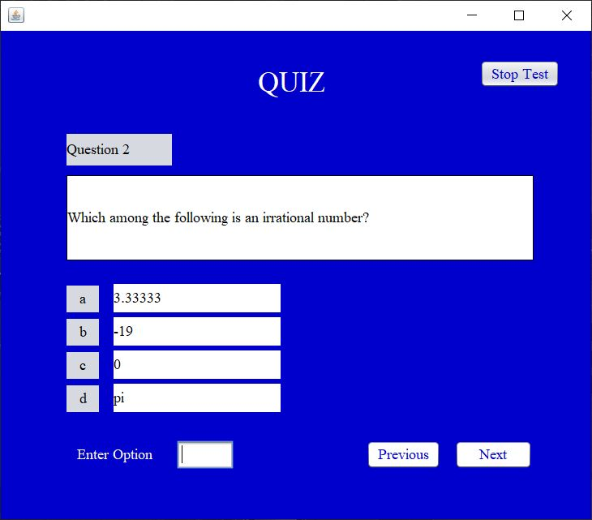

# Quiz-Application-Simple-

This is a simple application developed through netbeans. This was developed as part of mini project in my college.

This application has two type of users
  1. Teacher
  2. Student
  
The application allows students to take part in quiz in a particular subject. The teacher adds question in a database. When a student starts the quiz, 10 questions are shown randomly from that selected subject. The teacher has power to add, remove, modify questions and also can add, remove users.

Added some screenshots of the application UI.
   

1. Home screen

    

2. Student's Home page

    

3. Teacher's Home page

    

4. Sign Up Page 

    

5. Adding new User (Only for teachers)

    

6. Managing Users (Only for teachers)

    

7. Adding Questions (Only for teachers)

    

8. Managing Questions (Only for teachers)

    

9. Quiz page (only for students)

    

10. Score page (Only for teachers)

  
